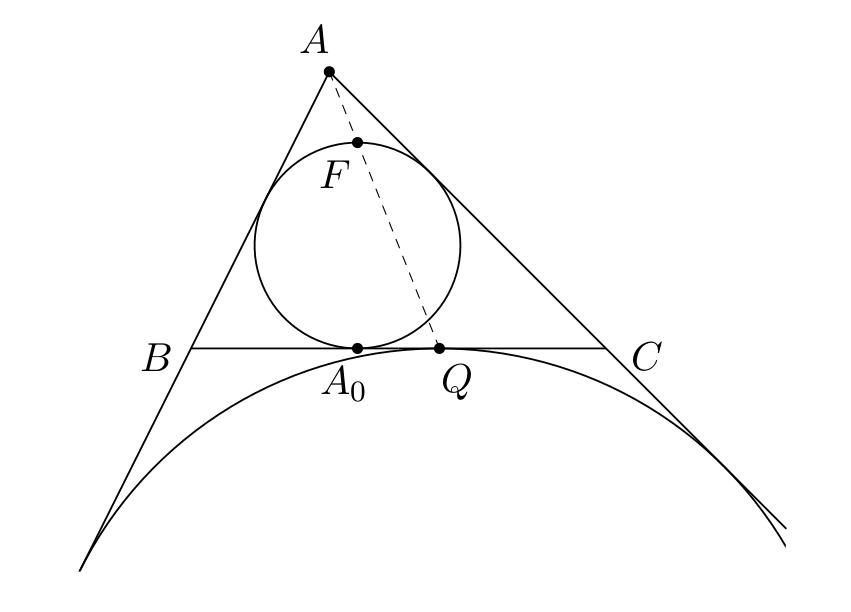

# Факт

Дан треугольник \\(ABC\\), вписанная в него в него окружность 
\\(\omega\\), касающаяся \\(BC\\) в точке \\(A_0\\), и вневписанная 
окружность \\(\Gamma\\), касающаяся стороны \\(BC\\) в точке \\(Q\\). Точка
\\(F\\) диаметрально противоположна точке \\(A_0\\). Докажите, что \\(A\\), 
\\(F\\) и \\(Q\\) лежат на одной прямой.

<!--  -->

