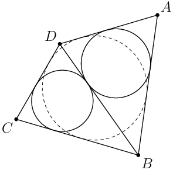

# Факт

\\(ABCD\\) – описанный четырехугольник вокруг окружности \\(\Omega\\).
Пусть \\(\alpha\\) и \\(\beta\\) вписанные окружности треугольников 
\\(ADB\\) и \\(CDB\\) соответственно. Тогда \\(\alpha\\) и \\(\beta\\) касаются 
\\(BD\\) в одной точке.

